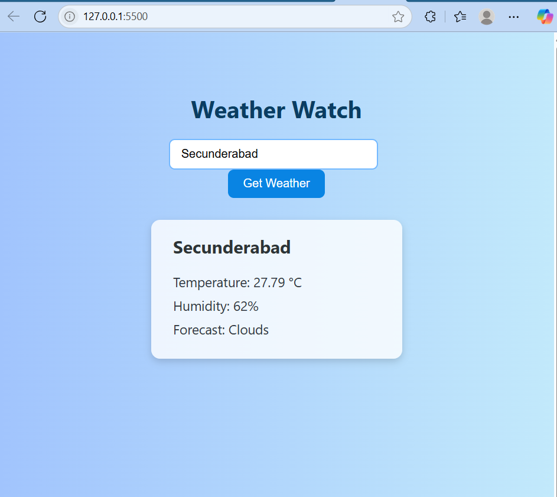

# weather-app
# Weather Watch

Weather Watch is a simple app that shows real-time weather information for any city you enter.

## Features
- Shows current **temperature**, **humidity**, and **weather conditions**
- Clean and responsive design
- Powered by [OpenWeatherMap API](https://openweathermap.org/api)

## Screenshot
 <!-- Add your screenshot here -->

## Files Included
- `index.html` - Page structure
- `style.css` - Stylish UI with gradients
- `script.js` - Weather API fetch and display logic

##  How to Run

1. Clone the repository:
```bash
git clone https://github.com/your-username/weather-watch.git
2. Open index.html in any browser
3.Get your free API key from OpenWeatherMap
  Sign up → Go to your API Keys section → Copy your key
4.Paste your key in script.js
  const apiKey = "YOUR_API_KEY"; // Replace with your actual key
